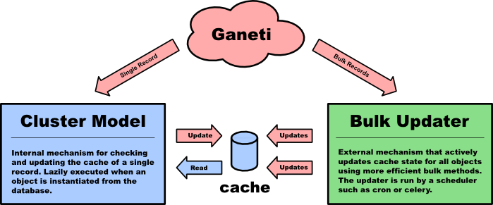
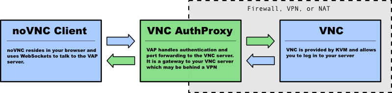
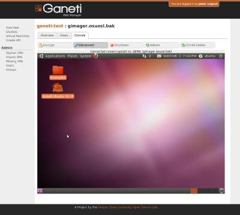

==================
Ganeti Web Manager
==================

Cluster Management Made Simple

Kenneth Lett
OSU Open Source Lab

Who are we?
===========

**OSU Open Source Lab**

- We provide infrastructure and hosting for Open Source Projects
- We foster and develop Open Source software
- We are from Oregon

What is GWM?
============

**Easy to use Web interface to Ganeti**

.. rst-class:: build

- Make everything visible
- Client-facing interface
- Leverage all of Ganeti's features via RAPI
- Provide granular permissions
- Organize users arbitrarily
- Make management easy with templates and bulk actions

GWM Structure
=============

.. rst-class:: build

- Django web framework
- JQuery
- Open Sourced Components
- Django Object Permissions
- Django Object Log
- NoVNC

GWM Structure
=============

.. rst-class:: build

- User/Group structure determines authorization and ownership
- Models encapsulate persistent data for clusters and instances
- Changes to the models are communicated to Ganeti as jobs
- Cache system updates models from current Ganeti state

GWM Structure
=============

Caches cluster information to avoid frquent API calls

GWM Structure
=============

- NoVNC provides console access from the web interface
- VNC Auth proxy allows access to a VNC terminal on instances from the web client 

VNC Auth Proxy
==============

VNC Authentication proxy allows vnc access to private networks

VNC Auth Proxy
==============

Interacting with the RAPI
=========================

Live Demo
=========

Live Demo (if time)

Lessons Learned
===============

Questions?
==========

Ken Lett
kennric@osuosl.org
kennric, @kenlett
@ramereth

Lance Albertson
lance@osuosl.org
http://lancealbertson.com

http://code.google.com/p/ganeti/
http://code.osuosl.org/projects/ganeti-webmgr

#ganeti-webmgr
#osuosl
